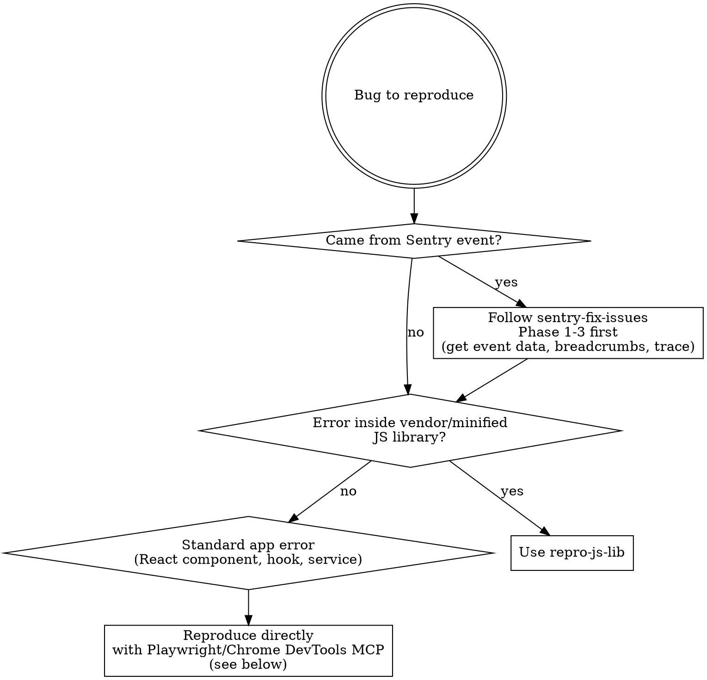

# Reproducing Errors

## Overview

Reproduction is a **hard gate before code changes.** You must confirm the bug fires in a real browser session before touching source code. This prevents fixing the wrong thing, applying optional chaining to the wrong variable, or shipping changes that don't address the actual failure path.

**Required output** — all three files go inside `.playwright-mcp/<sentry-or-jira-id>/`:

- Video: `.playwright-mcp/<sentry-or-jira-id>/reproduction-<sentry-or-jira-id>-<error-slug>.webm`
- Script: `.playwright-mcp/<sentry-or-jira-id>/reproduce-<sentry-or-jira-id>-<error-slug>.cjs`
- Report: `.playwright-mcp/<sentry-or-jira-id>/reproduction-<sentry-or-jira-id>-<error-slug>.md` with investigate, solution fix, reproduce steps: <Step><What it does><Real user or injected?>

**Naming format:** `<sentry-or-jira-id>` is the short ID (e.g. `MATHGPT-1D2`, `PROJ-123`). `<error-slug>` is a short kebab-case description of the error (e.g. `codePointAt`, `smartfence-crash`). All three output files share the same base name and live in the same subfolder named after the issue ID.

## Decision Tree



## Tool Selection

| Available                                       | Video recording          | Use                                                                                                 |
| ----------------------------------------------- | ------------------------ | --------------------------------------------------------------------------------------------------- |
| Playwright MCP (`mcp__playwright__*`)           | ✅ Yes (`recordVideo`)   | Preferred — full browser control, video recording                                                   |
| Chrome DevTools MCP (`mcp__chrome-devtools__*`) | ❌ No (screenshots only) | Interactive debugging / quick snapshot; write a Playwright `.cjs` script when a `.webm` is required |

**Chrome DevTools MCP cannot record video.** It only has `take_screenshot`. If the task requires a `.webm` reproduction recording, use Playwright (either the MCP or a `.cjs` script via the `mathgpt-auth` scaffold).

## Reproducing Standard App Errors (MCP Direct)

### Step 1 — Map the path

From the error report / Sentry breadcrumbs, identify:

- Starting URL
- Exact sequence of actions (click, type, navigate, wait)
- The state condition that must hold (logged in? specific course? specific input?)

### Step 2 — Drive the browser

```
browser_navigate → URL
browser_click / browser_fill / browser_type → reproduce user actions
browser_wait_for → wait for async state to settle
browser_snapshot → capture accessibility tree at crash point
browser_take_screenshot → visual evidence
```

### Step 3 — Confirm the error

```
browser_console_messages  (Playwright MCP)
list_console_messages     (Chrome DevTools MCP)
```

The console output must show the **same error message or stack frame** as the report. A related-but-different error is not sufficient evidence.

### Step 4 — Produce evidence

**Video (preferred):** Use the Playwright script scaffold from `repro-js-lib` with `recordVideo` enabled.

**Steps file:** Create `reproduce-steps.md`:

```markdown
# Bug Reproduction Steps

## Environment

- URL: <exact URL>
- Browser: Chrome <version>
- User state: <logged in as X, course Y open, etc.>

## Steps

1. Navigate to <URL>
2. Click <element>
3. Type <value> in <field>
4. ...

## Actual Result

<paste console error / screenshot description>

## Expected Result

<what should happen>

## Console Output
```

<paste exact error message and stack>
```
```

## STOP Conditions

Stop and report to user instead of proceeding to code changes when:

- Error only occurs on production data not available locally
- Error requires a specific server-side state you cannot replicate
- Error is timing/race-condition dependent and inconsistently reproducible
- After 3 honest attempts, the exact error cannot be triggered

Document attempts in `reproduce-steps.md` before escalating.

## Red Flags — You Are Skipping Reproduction

| Rationalization                           | Why it fails                                                 |
| ----------------------------------------- | ------------------------------------------------------------ |
| "The fix is obvious from the stack trace" | Obvious != correct. Reproduce first.                         |
| "It's just adding optional chaining"      | Optional chaining on the wrong variable changes nothing      |
| "I reproduced it mentally"                | Mental simulation is not browser evidence                    |
| "The error message explains itself"       | Understanding ≠ knowing when it triggers                     |
| "I'll verify after the fix"               | Pre-fix reproduction ≠ post-fix verification. Both required. |
| "It's a one-liner fix"                    | One-liners without reproduction ship wrong code              |

## Specialized Skills

| Scenario                                        | Skill                               |
| ----------------------------------------------- | ----------------------------------- |
| Error stack trace inside vendor/minified JS     | `repro-js-lib`     |
| MathQuill `prayer failed:` / pointer corruption | `repro-mathquill`      |
| `@gotitinc/mathlive` TypeError/RangeError       | `repro-mathlive`       |
| Error inside Canvas LTI iframe (OAuth gated)    | `repro-canvas-lti` |
